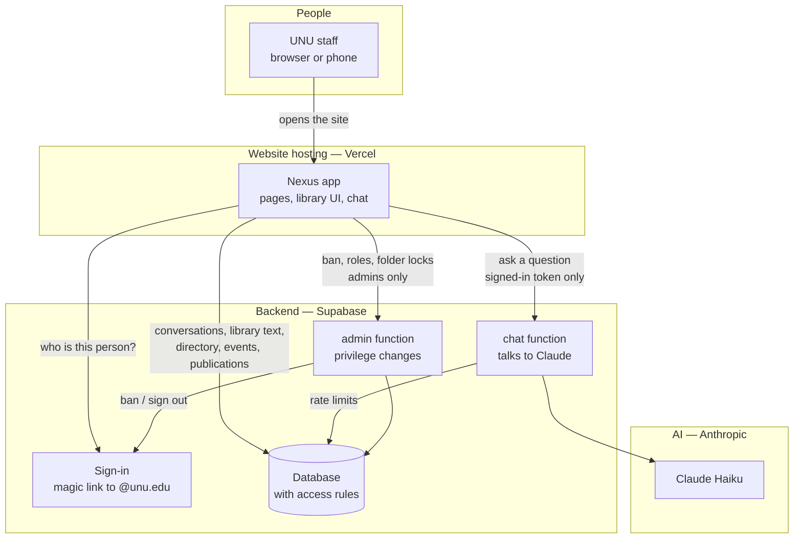
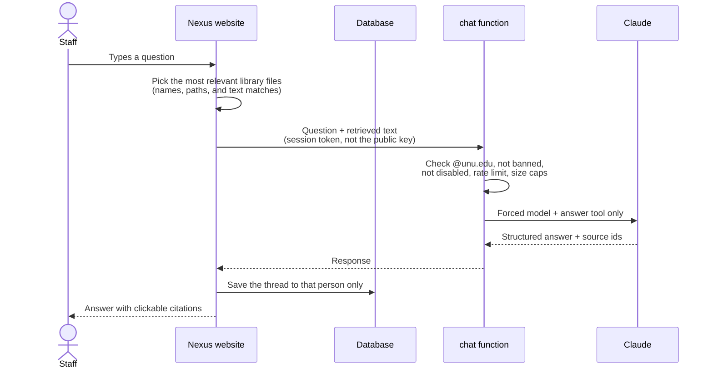

<p align="center">
  
</p>

<h1 align="center">UNU Nexus</h1>

<p align="center">
  <strong>Institutional knowledge for UNU Global Health</strong><br />
  Grounded answers. A shared library. Directory, events, and publications — in one staff workspace.
</p>

<p align="center">
  <a href="#at-a-glance">Overview</a> ·
  <a href="#how-the-pieces-connect">Architecture</a> ·
  <a href="#what-staff-can-do">Features</a> ·
  <a href="#how-secure-it-is">Security</a> ·
  <a href="docs/deploy.md">Deploy on your own domain</a>
</p>

<p align="center">
  
  
  
  
</p>

---

## How to read this

| If you are… | Start here |
|---|---|
| A supervisor or programme lead (10 minutes) | [At a glance](#at-a-glance) → [How the pieces connect](#how-the-pieces-connect) → [How secure it is](#how-secure-it-is) |
| Taking Nexus onto a UN domain or UN accounts | **[Deploy guide](docs/deploy.md)** — GitHub → Vercel → Supabase → custom domain |
| Reviewing the full product | [Documentation index](docs/README.md) |

The writing is technical where it needs to be, and always explains what that means in practice.

---

## At a glance

Nexus is an **internal staff tool** for United Nations University · Global Health. It is not a public website and not a general-purpose chatbot.

Staff sign in with their **`@unu.edu` email** (a one-time link, no password). Once inside, they can:

1. **Ask questions** of programme material and get answers with citations they can click.
2. **Keep a knowledge library** — folder trees of PDFs, Word, Excel, and text that the whole team can search (subject to access rules).
3. **Maintain shared registers** — directory contacts, the events matrix, and publications — with spreadsheet import and inline edit.
4. **Administer people and folders** — who may use the library, who is banned, which folders are locked.

**In plain terms:** it is a private knowledge desk for the programme. Staff ask in ordinary language; Nexus looks through documents the team has uploaded (and the events / publications registers), then answers with sources. It will say when it does not know.

The live site is a **Vercel** front end, built from this GitHub repository, talking to **Supabase** (sign-in and database) and **Anthropic Claude** (the model). The Claude API key lives only on the server. Production builds refuse to ship that key to browsers.

---

## How the pieces connect

Everything a staff member sees is one website. Behind it, three services do the real work. They never all sit on the same machine, and each has a job it is not allowed to skip.



**What this diagram is saying**

| Piece | Everyday meaning | What it actually does |
|---|---|---|
| **Vercel** | The address staff type in the browser | Serves the Nexus website. No secrets live here except the public Supabase “anon” key, which is useless without a signed-in session. |
| **Supabase Auth** | The lock on the door | Sends a magic link to an `@unu.edu` inbox. Other domains cannot create an account. Banned and disabled people are turned away. |
| **Supabase database** | The filing cabinets | Stores chats (private to each person), library text, directory, events, publications, and access rules. **Row Level Security** means the database itself refuses rows a person is not allowed to see — the website cannot override that. |
| **chat function** | The only door to Claude | Checks the person’s session, rejects banned/disabled users, caps payload size, allows only the two Nexus tools, rate-limits, then calls Anthropic. The anon key as a Bearer token is rejected. |
| **admin function** | The only door to privilege changes | Checks that the caller is an admin, then sets roles, bans (including Auth ban + global sign-out), disables accounts, locks folders, or deletes a user. The browser cannot write those tables directly. |
| **Anthropic** | The language model | Claude Haiku (`claude-haiku-4-5`). The model, token cap, and allowed tools are forced by the chat function — the browser cannot pick a different model. |

A question does not “go to the internet and search.” It goes: **staff → Nexus → chat function → Claude**, with a **retrieved slice** of the library plus events and publications, then back with citations.



Full technical map: **[Architecture](docs/architecture.md)**.

---

## What staff can do

| Area | What it is | Who it is for |
|---|---|---|
| **Chat** | Ask Nexus in ordinary language. Answers are cited. Click a citation to see the supporting quote; open the source in the library, events, or publications register. Attach files to a question. Save useful replies. History is **private to you**. | Everyone who can sign in |
| **Knowledge library** | Upload a file or a whole folder tree (PDF, Word `.docx`, Excel `.xlsx` / CSV, `.txt` / Markdown). Search by path or content. Right-click a folder → *Manage who can see this*. | Granted **read** or **edit** by an admin. New people start with **no library access**. |
| **Directory** | Shared contacts: UNU, government, NGO, partners, other. Search, filter, add, edit. | Signed-in staff |
| **Events** | 2026 events matrix — type, dates, partners, reach numbers, work packages. Import `.xlsx` / CSV; expand a row and edit fields in place. | Signed-in staff |
| **Publications** | 2026 publications mastersheet — authors, outlet, DOI, collections, work package. Same import / inline-edit pattern. | Signed-in staff |
| **Administrator Dashboard** | People, library roles, promote/demote admins, ban/unban, disable, remove access. Folder locks are managed from the library. | Admins only (the page is hidden; **the server** is what actually authorizes) |

Light and dark theme, collapsible sidebar, and a mobile layout are included.

Feature-level detail: **[Features](docs/features.md)** · leadership narrative: **[Overview](docs/overview.md)**.

---

## How secure it is

Nexus is built as an **internal UNU system**, not a public AI demo. The important idea: **the website is not trusted**. The database and the two Edge Functions decide who may read or change anything.

| Control | In plain terms |
|---|---|
| **`@unu.edu` only** | A Gmail or other work address cannot create an account. Enforced when the account is created, not only in the login form. |
| **Magic link, no password** | Staff click a link in their UNU inbox. Stolen passwords are not a Nexus problem. |
| **Anonymous visitors see nothing** | The public Supabase key cannot read or write application tables. |
| **Chats are private** | You only see your own conversations. |
| **Library is not “everyone sees everything”** | New users get library role **none**. Locked folders are omitted from the database result for people who are not on the allow-list. Admins always see all folders. |
| **Nobody can promote themselves** | Role, admin flag, and “disabled” are frozen for ordinary user sessions. Those changes go through the **admin** function, which checks admin status first. |
| **Claude is not a public proxy** | Chat requires a real user session. CORS is allow-listed (localhost + your site). No `*`. Model, tools, and size are forced. 40 requests / 10 minutes per person. |
| **Uploads are checked** | Paths cannot contain `.` / `..`. Files are sniffed by magic bytes. Legacy `.xls` is refused. Extracted text and file size are capped. |
| **Production cannot leak the API key** | If `VITE_ANTHROPIC_API_KEY` or `VITE_DEV_BYPASS_AUTH=true` is set, the production build **fails**. |

The bootstrap administrator is **`ayhnassef@unu.edu`** (`is_admin = true`, library role `edit`). UN ICT can add a break-glass address in the database without a code change.

Honest limits (not yet built): there is **no malware scanner**; retrieval still runs **in the browser** (the function caps what it will accept); scanned image-only PDFs need OCR, which is out of scope.

Full model, threat notes, and residual risk: **[Security](docs/security.md)**.

---

## Documentation

| Document | Audience | Contents |
|---|---|---|
| [Overview](docs/overview.md) | Leadership | What is possible, breadth of the site, how it feels to use |
| [Architecture](docs/architecture.md) | Technical + curious non-technical | Systems, data, how a question is answered |
| [Features](docs/features.md) | All | Every surface, file types, permissions matrix |
| [Security](docs/security.md) | Leadership + ICT | Auth, RLS, Edge Functions, what we do not claim |
| [Deploy](docs/deploy.md) | ICT / whoever will host | GitHub → Vercel → Supabase → **custom domain**, secrets, checklist |
| [Operations](docs/operations.md) | Admins | Day-to-day, break-glass, handover from the current personal setup |

---

## Current production

GitHub **`main`** is the locked-down stack. After Vercel rebuilds from that commit, production matches this backend.

| Item | Status |
|---|---|
| Frontend | Vercel, from [this repository](https://github.com/SirKaiwade/UNU_Nexus) |
| Database | `schema.sql` → `permissions.sql` → `security.sql` applied |
| Functions | `chat`, `admin`, and optional `before-user-created` deployed |
| Secrets | `ANTHROPIC_API_KEY`, `ALLOWED_ORIGINS` (no trailing slash) |
| Auth hook | Deployed but **not required** — SQL already blocks other domains |
| Model key | Currently a **personal Anthropic key** on the chat function. For an institutional handover, replace it with a UN-held key (see [Deploy](docs/deploy.md)). |

If this project was ever reachable under the old open database policies, **rotate the anon key** after `security.sql`.

---

## Repository layout

```
src/                  Website (React + TypeScript)
  components/         Chat, library, directory, events, publications, admin
  lib/                Auth, permissions, retrieval, uploads, Supabase client
  pages/              Sign-in
supabase/
  schema.sql          Tables
  permissions.sql     Roles, bans, folder ACL tables
  security.sql        Access rules, triggers, grants
  functions/          chat, admin, before-user-created
docs/                 This documentation set
```

---

## Local development

For hosting on a UN domain, use **[Deploy](docs/deploy.md)** — not this section.

```bash
git clone https://github.com/SirKaiwade/UNU_Nexus.git
cd UNU_Nexus
npm install
cp .env.example .env.local
```

Fill `VITE_SUPABASE_URL` and `VITE_SUPABASE_ANON_KEY`. Optionally set `VITE_ANTHROPIC_API_KEY` and `VITE_DEV_BYPASS_AUTH=true` for local `npm run dev` only.

```bash
npm run dev
```

Open [http://localhost:5173](http://localhost:5173).

```bash
npm run build       # production build (fails if the two local-only vars are set)
npm run typecheck
npm run lint
```

---

## About

Built for **United Nations University · Global Health**.

Internal staff tool. Access and contributions are managed by programme administrators. Not a public open-source product.
