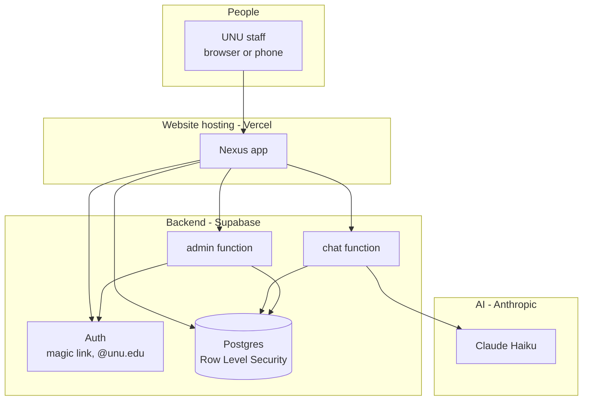
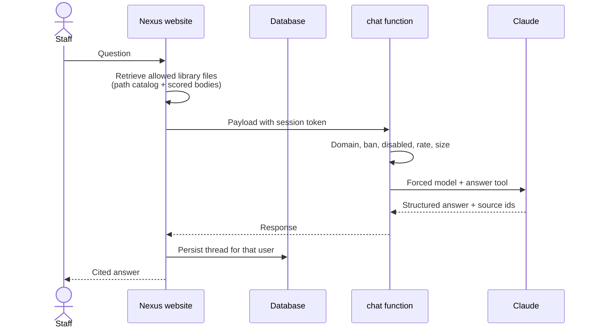
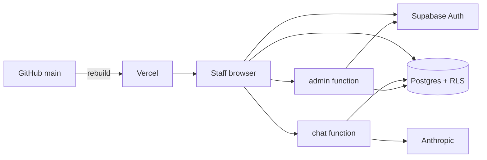
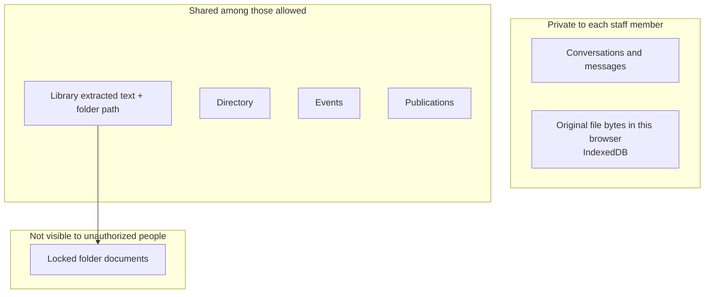
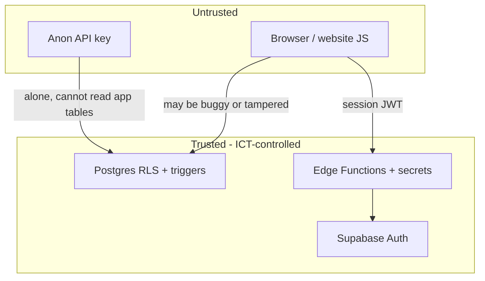

<p align="center">
  
</p>

<h1 align="center">UNU Nexus</h1>

<p align="center">
  <strong>Technical documentation - United Nations University · Global Health</strong><br />
  Architecture, data, access control, and a full deploy runthrough.
</p>

<p align="center">
  <a href="./README.md"></a>
  <a href="./TECHNICAL.md"></a>
</p>

<p align="center">
  <a href="#product">Product</a> ·
  <a href="#architecture">Architecture</a> ·
  <a href="#capabilities">Capabilities</a> ·
  <a href="#access-control">Access control</a> ·
  <a href="#deploy">Deploy</a> ·
  <a href="#operations">Operations</a>
</p>

<p align="center">
  
  
  
  
</p>

---

You do **not** need this file to get Nexus working. It is the deep runthrough: system architecture, database policies, Edge Functions, and a detailed install. For what the product does, what it does not, and the account-transfer checklist, use the [Handover Documentation](README.md).

SQL and Edge Functions are authoritative if they disagree with the UI.

| Contents | Anchor |
|---|---|
| Product and scope | [Product](#product) |
| Systems and data | [Architecture](#architecture) |
| Surfaces and permissions | [Capabilities](#capabilities) |
| Authentication and RLS | [Access control](#access-control) |
| Hosting and custom domain | [Deploy](#deploy) |
| Administration and account transfer | [Operations](#operations) |

---


## Product

Nexus is an **internal staff application** for UNU Global Health. It is not a public website and not a general-purpose chatbot.

Staff authenticate with an **`@unu.edu` magic link** (no password). After sign-in they can:

1. **Ask questions** of programme material and receive cited answers.
2. **Maintain a knowledge library** - folder trees of PDF, Word, Excel, and text, subject to roles and folder allow-lists.
3. **Maintain shared registers** - directory, events matrix, publications - with spreadsheet import and inline edit.
4. **Administer access** - library roles, bans, disabled accounts, folder visibility.

Nexus answers from uploaded library text (that the caller is allowed to read) plus the events and publications registers. It does not search the public internet. If the corpus does not support an answer, the model is instructed to say so.

The site is hosted on **Vercel**, built from this GitHub repository. **Supabase** provides authentication, Postgres, and Edge Functions. **Anthropic Claude Haiku** is invoked only from the `chat` function. The API key is a server secret. Production builds fail if `VITE_ANTHROPIC_API_KEY` or `VITE_DEV_BYPASS_AUTH=true` is set.

---

### Users

| Group | Access |
|---|---|
| Researchers and programme staff | Cited answers from reports, briefs, spreadsheets, events, and publications they are allowed to read |
| Team leads | Shared library; folders may be restricted to named people |
| Administrators | Account status, library roles, bans, folder visibility |
| Programme | One staff application instead of unofficial chatbots and scattered files |

---

### Session

1. Open the site; enter a UNU email.
2. Receive a **magic link** (one-time sign-in; no password).
3. Sidebar: Chat, Knowledge library, Directory, Events, Publications; administrators also see Administrator Dashboard.
4. Chat is the default route. Answers use **[1] [2]** citations. A citation click loads a verbatim quote. Library links use folder breadcrumbs.
5. If the corpus cannot support an answer, the model is instructed to say so rather than invent facts.

Conversations are **per user**. Other people’s threads are not readable through the product or the API.

---

#### Module detail

Nexus is five modules under one authentication and shell.

### Chat

**In scope**

- Questions over allowed library files (location and content).
- Questions over the **events matrix** and **publications** register.
- Attach a file to a question so it is always included in retrieval.
- Citations, source open, saved replies, continued threads.

**Out of scope**

- Public web search.
- OCR for image-only scanned PDFs.
- Treating one person’s chat as a shared team corpus (threads are not shared).

### Knowledge library

**In scope**

- Single-file or folder-tree upload; structure preserved.
- PDF, Word (`.docx`), Excel (`.xlsx`, CSV), plain text and Markdown.
- Search by filename, path, or extracted text.
- Share extracted text and path with the team, subject to role and folder locks.
- Restrict a folder to named people (or administrators only). Unauthorized users **do not receive those rows from the database**.

**Out of scope**

- Legacy `.xls` (save as `.xlsx` or CSV).
- Malware scanning.
- A shared binary file store. Shared rows are **extracted text and metadata**. Original bytes remain in the uploader’s browser storage for local preview.

### Directory

Shared contacts: UNU, government, NGO, partners, other. Search and edit. Empty until staff add rows.

Any **active signed-in** staff member can edit directory rows (shared register, not an approval workflow).

### Events

2026 events matrix: type, dates, purpose, work package, partners, funder, modality, geographic level, reach numbers where recorded, outputs, comms links. Import `.xlsx` / CSV; inline edit. Chat can cite `ev-…` ids.

### Publications

2026 publications mastersheet: authors, outlet, DOI, collections links, Pelikan id, ISBN, work package, audience, Global South flag, purpose. Same import / inline-edit. Chat can cite `pub-…` ids.

### Administrator Dashboard

Visible to administrators. **Hiding the route is not authorization.** Privilege changes run through a server function that verifies the caller is an administrator:

- Grant or revoke admin
- Set library role: none / view / edit
- Ban or unban (Auth ban and global sign-out)
- Disable an account
- Delete a user
- Lock a folder and set viewers (from the library UI)

New accounts receive **no library access** until an administrator grants it. They may still use Chat against events/publications and Directory / Events / Publications as active staff.

---

### How a question is answered

The full library is not sent to the model. Nexus:

1. Builds a catalog of every **allowed** file path.
2. Scores files by name, folder path, and overlap with the question.
3. Sends the highest-scoring bodies (plus composer attachments) up to a character budget.
4. Includes the current events and publications registers.
5. Instructs the model to use only that packet, cite sources, and decline if the packet is insufficient.

Folder naming affects “where is X?” as much as file contents.

---

### Scope

| Claim | Fact |
|---|---|
| Faster retrieval of programme material | Depends on a populated, clearly named library. An empty library still allows events/publications Q&A; document Q&A will report an insufficient corpus. |
| Replacement for SharePoint | No. Optional SharePoint import requires Azure AD approval. Nexus is a knowledge layer, not the records system of record. |
| API key in the website | No. The Anthropic key is a Supabase secret. Production builds fail if it is placed in `VITE_`. |
| Access limited to UNU | Accounts must be `@unu.edu`. Banned and disabled users are rejected at Auth, at the database, and at chat/admin. |
| Library access | Default for new users is none. Folders can be locked. |
| UN security accreditation | This is an internal access model, not an accreditation package. ICT owns vendor accounts, domain, SMTP, and key rotation. See [Deploy](#deploy) and [Access control](#access-control). |
| Model cost | Claude Haiku; 40 chat requests / 10 minutes / user. Vercel + Supabase at typical 10-15 staff scale. |

---

### Constraints

- No malware scanning of uploads.
- Retrieval is assembled in the browser; `chat` caps size, tools, and rate. Callers cannot select another model or use the function as an open Claude proxy. They can include text from files they are already allowed to read.
- Original binaries are not a shared cloud store.
- Directory, events, and publications are editable by any active signed-in user.
- The optional Before User Created Auth hook is redundant with SQL domain and ban checks.

---


## This package

| Item | Status |
|---|---|
| Frontend | Vercel, from [this repository](https://github.com/SirKaiwade/UNU_Nexus) |
| Database | `schema.sql` → `permissions.sql` → `security.sql` |
| Functions | `chat`, `admin`; optional `before-user-created` |
| Secrets | `ANTHROPIC_API_KEY`, `ALLOWED_ORIGINS` (no trailing slash) |
| Auth hook | Optional; SQL already restricts domain |
| Claude billing | Move to a UN-held Anthropic account ([Operations](#operations)) |
| Written package | Short handover: [README.md](README.md). This file: technical runthrough. |


## Architecture



| Component | Role |
|---|---|
| **Vercel** | Serves the compiled website. Holds only public config: `VITE_SUPABASE_URL` and the anon key. |
| **Supabase Auth** | Issues magic-link sessions. Non-`@unu.edu` accounts cannot be created. Banned and disabled users are rejected. |
| **Postgres + RLS** | Stores conversations (owner-only), library text, directory, events, publications, and access metadata. Policies are enforced in the database. |
| **chat function** | Sole caller of Anthropic. Requires a user session (anon key as Bearer is rejected). Checks domain, ban, disabled. Allow-listed CORS. Forced model, tools, size caps, per-user rate limit. |
| **admin function** | Sole writer of admin flags, library roles, bans, disables, folder locks, and user deletion. Confirms the caller is an administrator. |
| **Anthropic** | `claude-haiku-4-5`. Model, token cap, and allowed tools are set by `chat`, not by the client. |

Request path for Q&A: staff → Nexus → `chat` → Claude, with a retrieved subset of allowed library text plus events and publications.



---

How UNU Nexus is assembled: components, data, and the path of a question.

### Runtime

The website is a static app (HTML/JavaScript) hosted on **Vercel**, rebuilt when **GitHub** `main` changes.

Sign-in and data live on **Supabase**:

- **Auth** - magic-link email, session tokens.
- **Postgres** - tables with **Row Level Security**.
- **Edge Functions** - `chat` and `admin`; hold secrets and checks the client is not trusted to enforce.

The model is **Anthropic Claude Haiku**. Only `chat` may call it. The key is a Supabase **secret**, not a Vercel `VITE_` variable.



---

### Runtime detail

### 1. The website (`src/`)

| Fact | Detail |
|---|---|
| Stack | React 18, TypeScript, Vite, Tailwind, React Router |
| Routes | `/` chat, `/library`, `/directory`, `/events`, `/publications`, `/admin`, `/login` |
| Auth wrapper | Everything except `/login` requires a session (`ProtectedRoute`) |
| Public config | `VITE_SUPABASE_URL`, `VITE_SUPABASE_ANON_KEY` - baked in at build time. These are *public* by design. They are not the service role key and not the Anthropic key. |
| Local-only | `VITE_ANTHROPIC_API_KEY` and `VITE_DEV_BYPASS_AUTH` work only with `npm run dev`. `vite.config.ts` **throws** if either is set during a production build. |

The browser talks to Supabase in two ways:

- **PostgREST** (the auto API over tables) for rows the user is allowed to touch - conversations, library documents they may see, directory, events, publications, their own profile fields that are not frozen.
- **Edge Functions** via `src/lib/edgeFn.ts`: `Authorization: Bearer <user access token>` plus `apikey: <anon key>`. The function **rejects** a request whose Bearer token *is* the anon key.

Markdown in answers only allows `http(s):` links, in-app paths starting with `/` (not `//`), and citation hashes `#nexus-cite-…` (`src/lib/safeUrl.ts`).

### 2. Postgres (`supabase/*.sql`)

Applied in order:

1. `schema.sql` - tables; RLS enabled with **no policies** (fail closed).
2. `permissions.sql` - `is_admin`, `library_role`, `banned_emails`, folder locks/viewers; bootstrap admin email.
3. `security.sql` - helpers, triggers, scoped policies, grants.

| Table | What it holds | Who can use it (authenticated, active `@unu.edu`) |
|---|---|---|
| `profiles` | Email, display name, admin flag, library role, disabled | Select: self or admin. Insert/update: self, but **privilege columns are frozen** by trigger. |
| `conversations` / `messages` | Chat threads | Owner only (`user_id` = current profile). |
| `library_documents` | Filename, path, extracted text, size | Select/write per `can_read_library_path` / `can_edit_library`. |
| `directory_contacts` | Directory | All active staff (shared register). |
| `events` / `publications` | Registers | All active staff. |
| `banned_emails` | Ban list | Select: admins. Writes: **not** granted to the browser. |
| `library_folder_locks` / `_viewers` | Folder ACL | Select: locks for active users; viewers for admin or “my own row”. Writes: **not** granted to the browser. |
| `app_settings` | e.g. bootstrap admin emails | No client grants. Service role / SQL editor. |
| `chat_rate_buckets` | Chat rate limit | No client grants. Chat function (service role) only. |

`anon` (not signed in) has **no** table privileges on application data.

### 3. Edge Functions (`supabase/functions/`)

Shared code:

- `_shared/auth.ts` - require a real JWT, not the anon key; `@unu.edu`; not banned; not disabled. `requireAdmin` also checks bootstrap list or `profiles.is_admin`.
- `_shared/cors.ts` - localhost plus `ALLOWED_ORIGINS` (comma-separated, **no trailing slash**, no `*`).
- `_shared/path.ts` - reject `.` / `..` / NUL in folder paths.

**`chat`**

- Model forced: `claude-haiku-4-5`
- `max_tokens` capped at 4096
- System prompt clipped to 400,000 characters
- Last 40 messages, 20,000 characters each
- Tools allowed: `answer`, `source_quotes` only
- Rate limit: 40 requests / 10 minutes / user (`chat_rate_buckets`)

**`admin`**

Actions: `set_admin`, `set_library_role`, `ban_email`, `unban_email`, `disable_profile`, `set_folder_viewers`, `delete_user`. Bootstrap admin cannot be demoted, banned, disabled, or deleted via this function.

**`before-user-created`** (optional Auth hook)

Rejects non-`@unu.edu` at the Auth HTTP hook. SQL trigger on `auth.users` already does this. Hook is defense in depth, not required for domain lock.

### 4. Anthropic

Called only from `chat`. Local `npm run dev` may call Anthropic **from the browser** if `VITE_ANTHROPIC_API_KEY` is set - that path is compile-blocked for production.

---

### Data: shared vs private



| Kind | Stored where | Shared? |
|---|---|---|
| Chat | `conversations`, `messages` | No - owner only |
| Library text + path | `library_documents` | Yes, after RLS (role + folder ACL) |
| Original PDF/Word/Excel bytes | Browser **IndexedDB** | No - local preview for that device |
| Directory / events / publications | Postgres tables | Yes, all active staff |
| Privileges, bans, folder ACL writes | Postgres; mutations via `admin` function | Admins |

On load, the app hydrates the library from Postgres, then **drops** any local copies the user must not see (`pruneLibraryByAccess`). The database already omitted locked rows they cannot read; this is a second pass for leftovers on the device.

---

### Retrieval (technical)

Code: `src/lib/retrieve.ts` → `src/lib/nexus.ts` → `chat` function.

1. **Catalog** - every library file the user is allowed to see: id, path, breadcrumb, size. This is how “where is the file?” works even when the body is not retrieved.
2. **Pinned attachments** - files attached on the composer go in first.
3. **Score** - tokenize the question (stopwords removed). Score filename (heavy), path, breadcrumb, and limited body hits.
4. **Budget** - up to 14 documents, ~28,000 characters each, ~120,000 characters total retrieved text.
5. **System prompt** - retrieved docs + catalog + events register + publications register + (legacy seed document/people blocks if present) + instructions: ground claims, cite, `noAnswer` if thin.
6. **Tool** - model must call `answer` once (structured fields: markdown, sources, follow-ups, flags).
7. **Filter** - source ids that are not known documents/events/publications/uploads are dropped so the UI never shows a phantom citation.
8. **Quotes on demand** - citation click calls `source_quotes` with the claim text, not the whole answer.

The chat function does **not** re-run retrieval. It trusts the packet the signed-in client sent **up to its caps**, after it has verified the person. Combined with RLS, a user cannot include library text they were never allowed to download.

---

### Uploads and path safety

`src/lib/uploads.ts` (browser) and triggers in `security.sql` (database):

| Check | Rule |
|---|---|
| Extension / MIME | PDF, `.docx`, `.xlsx`, CSV, `.txt`/Markdown |
| Legacy Excel | `.xls` refused |
| Magic bytes | PDF must start `%PDF`; Office Open XML must start `PK`; text/CSV must not look like PDF/ZIP |
| Size | 40 MB (browser and database) |
| Extracted text | Truncated at 1,500,000 characters (browser and database) |
| Path | Canonicalized; `.` / `..` / NUL rejected; database raises on invalid path |

Excel is read with **ExcelJS**, not a legacy spreadsheet stack.

PDF text uses `pdfjs-dist` in a worker. Image-only scans yield little or no text and are rejected as “no extractable text.”

---

### Optional connectors

| Connector | When it exists | Notes |
|---|---|---|
| **SharePoint / Microsoft Graph** | `VITE_AZURE_CLIENT_ID` (and optional tenant) | Read-only scopes. Tokens in `sessionStorage`. Files labelled **Confidential** are not imported. Needs UN Azure AD review before production. |
| **Local library folder** | `npm run dev` only | Vite middleware reads a desktop folder. Not in production. |
| **Local JSON for events/publications/directory** | `npm run dev` only | `data/local/*.json` - gitignored. Production uses Postgres. |

---

### Trust boundaries



- We **do not** assume the React app is honest about `isAdmin`.
- We **do** assume Supabase Auth signatures, service role kept off the client, and `ALLOWED_ORIGINS` listing only real site origins.
- We **do not** assume uploads are benign beyond type/size/path checks.

---

## Capabilities

What each part of UNU Nexus does, who can use it, and the rules that go with it.

---

### Sign-in

Staff enter an `@unu.edu` address and receive a one-time magic link. There is no application password.

| Behaviour | Detail |
|---|---|
| Allowed domain | `unu.edu` - checked in the form, in Auth (SQL trigger), in session handling, and again in Edge Functions |
| Banned emails | Cannot request a link; if they somehow have a session, they are signed out |
| Disabled accounts | Same: signed out with the admin’s reason when present |
| Redirect after link | Back to the site origin (production URL or custom domain) |
| Theme | Light by default; dark if the person previously chose it (`localStorage`) |
| Dev bypass | `VITE_DEV_BYPASS_AUTH=true` **and** `npm run dev` only. Production build fails if that flag is set |

---

### Shell

- UN stripe, brand mark, collapsible sidebar (remembered), mobile drawer
- Navigation: Chat, Knowledge library, Directory, Events, Publications
- Administrator Dashboard - only if `user.isAdmin` (UI). Server still enforces admin on every privileged action
- Conversation list (your threads only), new chat, delete thread
- Sign out
- Light / dark toggle
- Document viewer and citation rail slide in from the right

---

### Chat

Cited answers from allowed library files plus events and publications. Citation markers open a verbatim quote. Sources open in library, events, or publications.

| Capability | Notes |
|---|---|
| Threaded history | Stored per user in Postgres; titles from the first question |
| Grounding | Library (allowed files) + events + publications. Instructed not to invent |
| Citations | `[1]`, `[2]` → click → `source_quotes` tool → verbatim excerpt. Phantom ids stripped |
| Library deep links | Answers may link to `/library?path=…&file=…`. Only `http(s)`, in-app `/` paths, and citation hashes render |
| Attachments | PDF / Word / Excel / text on the composer; those ids are always retrieved first |
| Save a reply | Flag on the message in your thread |
| Follow-ups | Model asked for three concrete next questions |
| “I don’t know” | `noAnswer` when the packet cannot support a confident answer |
| Rate limit | 40 chat calls / 10 minutes / person (server) |
| Model | Claude Haiku, forced server-side |

Chat cannot be used as an open Anthropic proxy: no arbitrary model, no extra tools, no huge paste beyond caps.

---

### Knowledge library

Shared document corpus with folder structure. Administrators grant library roles and may restrict folders to named people.

### Files

| Allowed | Not allowed |
|---|---|
| `.pdf` | `.doc` (old Word) |
| `.docx` | `.xls` (old Excel) - save as `.xlsx` or CSV |
| `.xlsx`, `.csv` | Random binaries, executables |
| `.txt`, `.md`, `.markdown` | Image-only PDFs with no extractable text (practical failure, not a type ban) |

Limits: 40 MB per file; extracted text capped at 1.5 million characters; path cannot contain `.` or `..`.

Magic-byte sniff: a file named `.pdf` that is not a PDF is rejected; Office files must look like ZIP/OOXML; text/CSV must not look like PDF or ZIP.

### Library roles (non-admins)

| Role | Label in UI | Meaning |
|---|---|---|
| `none` | No access | Default for **new** users. Library hidden / unusable |
| `view` | Read only | See allowed folders; no upload/delete |
| `edit` | Can edit | Upload and organise in folders they can see |

Admins always have full library access regardless of `library_role`.

### Folder locks

- Unrestricted folder: everyone with library access can see it.
- Locked folder: only people on the allow-list, plus admins.
- Locked with **empty** allow-list: **admins only**.
- Nested paths: the **most specific** lock wins.

Unauthorized users: the SQL policy `can_read_library_path` is false, so **those rows are not returned**. The UI also prunes local copies.

Editors with access use: upload, folder drop, new folder, delete file/folder, SharePoint import if configured, “Manage who can see this” (calls `admin` → `set_folder_viewers`).

### Shared library payload

Shared library rows are **extracted text + filename + folder path + size**, not a Dropbox-style original-file CDN. Preview of the original bytes is from **this browser’s IndexedDB** when the file was ingested here.

---

### Directory

Categories: UNU Directory, Government, NGO, Partners, Other.

Typical fields: name, role, team, organisation, email, phone, country, location, expertise, tags, notes, avatar initials/colour.

Search across name, organisation, role, expertise, country, tags. Sort by name, organisation, or category. Add / edit / delete. Any **active signed-in** staff member may change rows (shared register, not approval workflow).

---

### Events

Programme events matrix (2026). Types include conference/symposium, webinar/seminar, workshop, policy dialogue, consultation/roundtable, coordination/partnership meeting, side event, other.

Also tracked (when filled): dates, strategic purpose, work package, owner, partners, funder, programme, location, modality (in person / virtual / hybrid), geographic level, participant numbers and percentages, Global South / gender / youth, south-south exchange, outputs, file/article/media links, high-level participants, status, staff count.

**Import** `.xlsx` / CSV. **Inline edit** after expanding a row. Chat can cite an event as a source (`ev-…`).

---

### Publications

Mastersheet fields include title, date, first/other authors, type, outlet, link, DOI, collections link, external link, URL, full citation, Pelikan project id, in-collections flag, ISBN, files, work package, target audience, Global South, purpose.

Same import and inline-edit pattern. Chat can cite (`pub-…`).

---

### Administrator Dashboard

Tabs: **People** and **Banned emails**.

| Action | Effect |
|---|---|
| Set library role | `none` / `view` / `edit` |
| Make / remove admin | Cannot strip admin from the bootstrap account |
| Disable | Soft-disable, library role none, global sign-out |
| Ban | Row in `banned_emails` + Auth `ban_duration` ~ 100 years + global sign-out |
| Unban | Remove row; clear Auth ban |
| Delete user | Auth delete (profile cascade where FK allows) |

Bootstrap email: `ayhnassef@unu.edu` (also listed in `app_settings.bootstrap_admin_emails`). Cannot be banned, disabled, demoted, or deleted through the admin function.

---

### Permissions matrix

| | Signed out | Signed in, library `none` | `view` | `edit` | Admin |
|---|---|---|---|---|---|
| Open the app | Login only | Yes | Yes | Yes | Yes |
| Own chats | - | Yes | Yes | Yes | Yes |
| Other people’s chats | - | No | No | No | No |
| Directory / events / publications | - | Read/write | Read/write | Read/write | Read/write |
| See unrestricted library files | - | No | Yes | Yes | Yes |
| See locked folder | - | No | If on allow-list | If on allow-list | Always |
| Upload / delete library | - | No | No | Where they can see | Yes |
| Change roles / bans / locks | - | No | No | No | Yes (server) |
| Call `chat` | No | Yes* | Yes* | Yes* | Yes* |
| Call `admin` | No | No | No | No | Yes |

\*Active `@unu.edu`, not banned, not disabled; then rate limits apply.

---

### Optional: SharePoint

If Microsoft Graph is configured, editors can sign in to Microsoft and import from drives/sites. Read-only Graph scopes. Items with retention label **Confidential** are blocked. This is off until `VITE_AZURE_CLIENT_ID` is set and Azure AD is approved.

---

### Chat vs library visibility

Chat retrieval uses **the same library set already loaded for that user**. It cannot search locked folders that RLS hid. Events and publications are included for every active user because those tables are shared registers.

---

## Access control

Access model for the product being handed over. Nexus is an internal UNU Global Health staff application. The website is not the security boundary. **Postgres Row Level Security** and the **chat / admin Edge Functions** authorize reads and writes.

This is a designed internal access model. It is not a UN-wide accreditation, an ISO certificate, or a classified-system rating. ICT should hold GitHub, Vercel, Supabase, and Anthropic organisations, the custom domain, mail delivery, and key rotation.

---

### Who may use it

| Rule | Implementation |
|---|---|
| Institutional email only | Accounts must be `@unu.edu`. Enforced on `auth.users` (insert/update of email), in the client, and on every chat and admin call. Optional Before User Created hook is redundant if SQL is applied. |
| Magic link | One-time email link. Nexus does not store an application password. |
| Active staff only | Banned emails and disabled profiles cannot sign in, cannot query application tables, and cannot call chat or admin. |
| Library by grant | New profiles receive `library_role = none`. An administrator grants `view` or `edit`. Administrators see every folder. |
| Folder allow-lists | A locked folder is visible only to named people (or administrators). Empty allow-list: administrators only. Most specific path wins. Unauthorized users do not receive those rows. |

**`is_active_user()`:** role `authenticated`, uid present, JWT email like `%@unu.edu`, not banned, not disabled.

**Bootstrap / break-glass:** `public.app_settings` key `bootstrap_admin_emails`. `is_admin()` is true if the JWT email is on that list **or** `profiles.is_admin` (and not disabled). ICT can add an address and run `select public.elevate_bootstrap_admins();` - no code deploy. The product will not demote, ban, disable, or delete the bootstrap account from the dashboard. Bootstrap administrator in this handover: **`ayhnassef@unu.edu`**.

---

### Where authorization happens

| Layer | Responsibility |
|---|---|
| Database (RLS) | Postgres refuses rows the caller may not see or change, including direct API access. Signed-out callers have no table privileges. `FORCE ROW LEVEL SECURITY` is on. |
| `chat` | Sole path to Claude. Requires a user session (anon key as Bearer rejected). Domain, ban, disabled. Allow-listed origins. Forced model, tools, size caps. 40 requests / 10 minutes / user. |
| `admin` | Sole path that can change admin flags, library roles, bans, disables, folder locks, or delete a user. Confirms the caller is an administrator. The browser has no write grants on those tables. |
| Website | Hides Admin from non-administrators; sends the session token to chat/admin; renders only safe markdown hrefs. Supporting, not sufficient. |

Authentication sequence:

1. Magic link (`signInWithOtp`).
2. `enforce_auth_email_policy` on `auth.users`.
3. `handle_new_user` creates `profiles` with `library_role = none`, `is_admin = false`, unless the email is in `bootstrap_admin_emails`.
4. Client `resolveSessionUser`: domain, ban, disabled → sign out.
5. Edge Functions: `getUser(jwt)`; reject if jwt equals `SUPABASE_ANON_KEY`; domain; ban; disabled.

---

### Data scope

Policies: `supabase/security.sql`. Applied after `schema.sql` (RLS on, no policies) and `permissions.sql`.

| Data | Who can reach it |
|---|---|
| Conversations / messages | Owner only (`user_id = current_profile_id()`; messages via parent conversation) |
| Library documents | `can_read_library_path`; writes also require `can_edit_library()` |
| Directory, events, publications | Any active signed-in staff member |
| `banned_emails` | Select: administrators. Writes: not granted to the client |
| Folder locks / viewers | Locks: select if active. Viewers: admin or own `profile_id`. Writes: not granted to the client |
| Privilege columns on `profiles` | Frozen for user JWTs (`protect_profile_privileges`). Service role (admin function) may change them |
| `app_settings`, `chat_rate_buckets` | No client grants |

`anon` has no table privileges on application data.

Library ingest trigger `enforce_library_document_limits`: canonical path or exception; text clipped to 1,500,000 characters; size > 40 MB rejected.

---

### Claude

| Control | Setting |
|---|---|
| Caller | Signed-in `@unu.edu`; not banned; not disabled |
| Origin | localhost (development) plus `ALLOWED_ORIGINS` - no `*`, no trailing slash. Unknown Origin → 403 |
| Model | `claude-haiku-4-5` |
| Tools | `answer`, `source_quotes` |
| Size | System ≤ 400,000 characters; last 40 messages; 20,000 characters each; `max_tokens` ≤ 4096 |
| Rate | 40 / 10 minutes / user (`chat_rate_buckets`) |
| API key | Supabase secret `ANTHROPIC_API_KEY`. Production build fails if set as `VITE_`. |

---

### Uploads and markdown

Accepted: PDF, `.docx`, `.xlsx` / CSV, `.txt` / Markdown. Magic-byte sniff. Legacy `.xls` refused. Paths cannot contain `.` / `..` / NUL. 40 MB; 1.5 million extracted characters (browser and database). Answer hrefs: `http(s):`, in-app `/` paths (not `//`), citation hashes.

Frontend (supporting): session access token in `src/lib/edgeFn.ts`; `isSafeHref`; ExcelJS; Vite refuses `VITE_ANTHROPIC_API_KEY` and `VITE_DEV_BYPASS_AUTH=true` in production. Optional SharePoint: read-only Graph scopes, Confidential label blocked, Azure AD review required.

---

### Secrets

| Secret | Location | Must not be |
|---|---|---|
| Anthropic API key | Supabase `ANTHROPIC_API_KEY` | Vercel `VITE_*`, GitHub, the browser |
| Service role | Injected into Edge Functions | Any `VITE_*` or the client |
| Anon key | Vercel `VITE_SUPABASE_ANON_KEY` (public by design) | Treated as a password - it is not; RLS protects data |
| `ALLOWED_ORIGINS` | Supabase secrets | Wildcard or trailing slash |
| `AUTH_HOOK_SECRET` | Supabase, if the hook is enabled | The client |

If a key is exposed, rotate it at the vendor and update the matching secret or Vercel variable. Changing the anon key requires a Vercel **redeploy** (compiled into the site) and staff sign in again.

---

### Constraints

| Limit | Implication |
|---|---|
| No malware scanner | Type, size, and path checks only. Treat uploads as trusted-staff content. |
| Retrieval in the browser | `chat` caps the payload. Callers cannot include files RLS hid. They can include text they are allowed to read. |
| Shared registers | Any active staff member can edit directory, events, publications. Use backups. |
| Original bytes | IndexedDB on the device. Not a records archive. Keep source files in SharePoint/drive. |
| Model input | Claude receives retrieved text for that request. Institutional Anthropic account and vendor terms are a procurement matter. |
| Magic-link mail | Configure UN SMTP ([Deploy](#deploy)). |
| Formal audit | No ISO / UN DSS claim in this repository. |

---

### ICT responsibilities

1. Own GitHub, Vercel, Supabase, and Anthropic organisations.
2. Keep custom domain, `ALLOWED_ORIGINS`, and Auth Site URL / Redirect URLs aligned.
3. Restrict SQL Editor and service-role access.
4. Custom SMTP for magic links.
5. Confirm whether directory/events/publications should remain editable by all active staff.
6. Optional: enable the Before User Created hook.

---

## Deploy

Hosting procedure. When complete, staff open the assigned hostname, sign in with `@unu.edu`, and the application uses the organisation’s database and Claude key.

This handover uses **Vercel** built from **GitHub `main`**, **Supabase** for Auth/data/functions, and Anthropic for Claude. Production should run under **UN-held vendor accounts** and, if required, a **UN hostname**.

---

### Required accounts

| Account | Role |
|---|---|
| **GitHub** | Source of truth. Vercel rebuilds on `main`. |
| **Vercel** | Hosts the website and the custom domain. |
| **Supabase** | Authentication, Postgres, `chat` and `admin` functions. |
| **Anthropic** | Claude billing. API key stored **only** in Supabase, never in Vercel. |

ICT creates DNS (for example `nexus.unu.edu` → Vercel). Auth Site URL, Redirect URLs, and `ALLOWED_ORIGINS` must list that origin.

Do **not** put the Anthropic key or the Supabase **service role** key in Vercel `VITE_*` variables. Those values are compiled into the public website.

---

### Outcome

- Website on Vercel, optionally at `https://nexus.unu.edu` (or another hostname ICT assigns)
- Magic-link sign-in returning to that hostname
- Database with `security.sql` policies applied
- `chat` and `admin` functions deployed
- Claude billed to an institutional Anthropic workspace
- Bootstrap administrator able to sign in and grant library access

Hands-on time: about 90-150 minutes, plus DNS propagation.

---

### Accounts to create (or take over)

Use a **team / organisation** account so the project is not tied to one staff member’s personal login.

1. **GitHub** - access to [SirKaiwade/UNU_Nexus](https://github.com/SirKaiwade/UNU_Nexus) (invite UN ICT, **transfer** the repo to a UNU org, or **fork**). Forks work; you then point Vercel at the fork.
2. **Vercel** - [vercel.com](https://vercel.com) · create a team · GitHub integration allowed to that repo.
3. **Supabase** - [supabase.com](https://supabase.com) · New project (region close to users, e.g. `eu-central-1` or a region ICT prefers). Save the database password in a password manager.
4. **Anthropic** - [console.anthropic.com](https://console.anthropic.com) · organisation under UNU · billing · API key with access to **Claude Haiku**.

Optional later: Microsoft Azure AD app registration (SharePoint import only).

---

### Path A - Transfer this running instance

Use when ICT takes over the existing GitHub, Vercel, and Supabase project (data retained).

1. Invite UN ICT as **Owner** on Vercel, Supabase, and GitHub (or transfer those organisations).
2. Create an **institutional** Anthropic key. Set `supabase secrets set ANTHROPIC_API_KEY=...`. Confirm chat. Revoke any previous key.
3. Skip creating a new Supabase project and re-running SQL unless ICT wants a clean slate.
4. If the public hostname changes, complete [Custom domain](#8-custom-domain) then [Auth and CORS](#9-auth-and-cors-must-match-the-public-origin).

---

### Path B - Fresh install from GitHub

Use this for a clean UN project, or if you must not reuse the demo database.

Work top to bottom. Have two browser tabs: GitHub repo, and this file.

---

### 1. Get the code on GitHub

- Preferred: UNU GitHub organisation owns `UNU_Nexus`.
- Or: ICT is collaborator on the existing repo with permission to change Vercel’s connection.

Clone is only needed on a laptop if someone will run SQL via CLI; the SQL Editor in the Supabase dashboard is enough.

```bash
git clone https://github.com/SirKaiwade/UNU_Nexus.git
cd UNU_Nexus
```

---

### 2. Create the Supabase project

1. Dashboard → **New project**.
2. Name e.g. `unu-nexus`.
3. Generate a strong database password; store it.
4. Wait until the project is **healthy**.
5. **Project Settings → API**:
   - Copy **Project URL** → this is `VITE_SUPABASE_URL`
   - Copy **anon public** key → `VITE_SUPABASE_ANON_KEY`
   - **Do not** copy `service_role` into Vercel or GitHub. Functions receive it automatically.

---

### 3. Apply the database (three scripts, in order)

Supabase → **SQL Editor → New query**. Paste **one file at a time**. Run. Confirm success before the next.

| Order | File | What it does |
|---|---|---|
| 1 | [`supabase/schema.sql`](supabase/schema.sql) | Tables. RLS on, **no policies yet** (nobody can read via the API). |
| 2 | [`supabase/permissions.sql`](supabase/permissions.sql) | Admin / disable / library role columns, ban table, folder ACL tables. Sets `ayhnassef@unu.edu` as bootstrap admin **when that profile already exists**. |
| 3 | [`supabase/security.sql`](supabase/security.sql) | Policies, triggers, grants, `app_settings`, rate-limit table. |

Safe to re-run `security.sql` (idempotent).

If the bootstrap person has **never signed in**, their profile is created on first magic link, and `handle_new_user` + `elevate_bootstrap_admins` grant admin because `app_settings` lists that email.

To add a UN ICT break-glass address **now**:

```sql
update public.app_settings
set value = 'ict-admin@unu.edu,ayhnassef@unu.edu'
where key = 'bootstrap_admin_emails';

select public.elevate_bootstrap_admins();
```

Use real `@unu.edu` addresses only.

---

### 4. Configure Auth (magic links)

Supabase → **Authentication**.

**Providers**

- **Email** enabled.
- Confirm that **magic link / OTP** is available (Email provider on). You do not need GitHub/Google login.

**URL configuration** (must match the real website)

Until Vercel gives you a URL, you can save placeholders and come back in step 9.

| Field | Example |
|---|---|
| **Site URL** | `https://unu-nexus.vercel.app` or later `https://nexus.unu.edu` |
| **Redirect URLs** | `http://localhost:5173/**` **and** `https://unu-nexus.vercel.app/**` **and** (when ready) `https://nexus.unu.edu/**` |

Do **not** add `*` as a redirect. Each extra origin you add is a place a stolen magic link could be sent.

**Email templates (optional but recommended)**

Authentication → Email templates → Magic link. Put the programme name “UNU Nexus” so staff trust the message.

**Custom SMTP (strongly recommended for production)**

Default Supabase mail is easy to filter as spam. Authentication → SMTP: use UN / Office 365 SMTP that ICT already operates. Then magic links come from a familiar UN address.

---

### 5. Install the Supabase CLI and log in

On a machine with Node.js:

```bash
npm install -g supabase
supabase login
supabase link --project-ref YOUR_PROJECT_REF
```

`YOUR_PROJECT_REF` is the subdomain of the API URL: `https://YOUR_PROJECT_REF.supabase.co`.

---

### 6. Deploy Edge Functions and secrets

From the repo root:

```bash
supabase functions deploy chat
supabase functions deploy admin
```

[`supabase/config.toml`](supabase/config.toml) sets `verify_jwt = false` for these functions. That is **intentional**: browser **OPTIONS** (CORS) preflight has no user token, and each function verifies the session JWT **itself** (and rejects the anon key as Bearer). Do not turn gateway JWT verification back on without re-testing login, chat, and admin from the real site origin.

Optional extra lock on sign-up:

```bash
supabase functions deploy before-user-created
```

Then Authentication → **Hooks → Before User Created** → that function URL, with `AUTH_HOOK_SECRET`. SQL already blocks other domains; skip the hook if ICT wants fewer moving parts.

**Secrets** (no quotes, no trailing slash on origins):

```bash
supabase secrets set ANTHROPIC_API_KEY=sk-ant-api03-...
supabase secrets set ALLOWED_ORIGINS=https://YOUR_APP.vercel.app
```

When the custom domain is live, **replace or extend** origins (comma-separated, both if you keep the vercel.app URL):

```bash
supabase secrets set ALLOWED_ORIGINS=https://nexus.unu.edu,https://YOUR_APP.vercel.app
```

Wrong: `https://nexus.unu.edu/`  
Right: `https://nexus.unu.edu`

Preview deployments on Vercel use URLs like `unu-nexus-git-branch-team.vercel.app`. Those **will not** call chat/admin unless you add each origin (usually you do **not** - keep previews from hitting production Claude).

Confirm:

```bash
supabase secrets list
```

You should see `ANTHROPIC_API_KEY` and `ALLOWED_ORIGINS` (values hidden).

---

### 7. Connect GitHub to Vercel

1. Vercel → **Add New → Project** → import the GitHub repo.
2. Framework: **Vite** (auto-detected).
3. Root directory: `.` (repo root).
4. **Environment variables** - Production **and** Preview if you want previews to sign in to the same backend (often Production only is cleaner):

| Name | Value |
|---|---|
| `VITE_SUPABASE_URL` | `https://YOUR_PROJECT_REF.supabase.co` |
| `VITE_SUPABASE_ANON_KEY` | the **anon public** key |

Do **not** set:

- `VITE_ANTHROPIC_API_KEY` - the **build will fail**
- `VITE_DEV_BYPASS_AUTH` - the **build will fail** if `true`
- `SUPABASE_SERVICE_ROLE_KEY` as `VITE_*`

5. Deploy. Wait for a green build.
6. Open the `*.vercel.app` URL. You should see the Nexus login page (UN stripe, magic link).

If the build fails with a message about `VITE_ANTHROPIC_API_KEY` or `VITE_DEV_BYPASS_AUTH`, delete those variables from Vercel and redeploy.

`vercel.json` already rewrites all paths to `index.html` so `/library` and magic-link returns work.

---

### 8. Custom domain

Vercel issues a `*.vercel.app` URL. A custom domain is a UN hostname (HTTPS) pointing at the same deployment.

#### 8.1 Choose a hostname

ICT typically picks a **subdomain** of an existing UNU zone, for example:

- `nexus.unu.edu`
- `nexus.globalhealth.unu.edu`

Apex (`unu.edu` itself) is unusual for an internal app and harder (A/ALIAS records). Prefer a subdomain.

#### 8.2 Add the domain in Vercel

1. Vercel → the Nexus project → **Settings → Domains**.
2. Add `nexus.unu.edu` (use the real name).
3. Vercel shows the DNS record to create. Commonly:

| Type | Name / host | Value |
|---|---|---|
| **CNAME** | `nexus` (or the subdomain prefix) | `cname.vercel-dns.com` |

If Vercel shows a different target, **use Vercel’s value**, not this table.

Some UN DNS panels want the fully qualified name `nexus.unu.edu` instead of `nexus`.

#### 8.3 Create the DNS record (UN ICT)

In the DNS host for `unu.edu` (or the delegated zone):

- Create the CNAME (or A/ALIAS if Vercel instructs).
- TTL: 300 seconds is fine while testing.
- If a **CAA** record restricts who may issue certificates, allow Let’s Encrypt / the CA Vercel uses, or HTTPS issuance will sit pending.

Do **not** also CNAME `www` unless you add `www.nexus.unu.edu` in Vercel too and decide which is canonical.

#### 8.4 Wait for HTTPS

Vercel issues a certificate automatically. Status on the Domains page: **Valid**. Until then, browsers may warn.

Check:

```bash
# Should eventually show Vercel / the site
curl -sI https://nexus.unu.edu | head
```

Or open the URL in a browser. You want the Nexus login page, padlock valid.

#### 8.5 Optional: make the custom domain primary

In Vercel Domains, set the UN hostname as **primary** so generated links prefer it. Keep `*.vercel.app` as a redirect **or** as a secondary origin - if you keep it reachable, it **must** stay on the Auth redirect list and on `ALLOWED_ORIGINS`, or that hostname’s chat will break.

---

### 9. Auth and CORS must match the public origin

Whenever the public URL changes, update **three** places. They must list the **same origins** (scheme + host, no path, no trailing slash).

**A. Vercel** - already serving the domain (step 8).

**B. Supabase Auth → URL configuration**

- Site URL = `https://nexus.unu.edu` (the one staff should land on after the email link).
- Redirect URLs include:
  - `https://nexus.unu.edu/**`
  - `https://YOUR_APP.vercel.app/**` if that URL still works
  - `http://localhost:5173/**` for developers

**C. Supabase secret**

```bash
supabase secrets set ALLOWED_ORIGINS=https://nexus.unu.edu,https://YOUR_APP.vercel.app
```

No redeploy of functions is required for secrets; the next request reads the new value.

If chat fails in the browser with **Origin not allowed** or a CORS error, `ALLOWED_ORIGINS` does not exactly match `https://` + hostname (check `www` vs non-`www`, http vs https, trailing slash).

If the magic link opens then dumps you on login, **Redirect URLs** or **Site URL** are wrong.

---

### 10. First admin sign-in and smoke test

1. Open `https://nexus.unu.edu/login`.
2. Request a link to the bootstrap email (`ayhnassef@unu.edu` or the ICT address you put in `app_settings`).
3. Open the mail (check spam if SMTP is still default).
4. You should land **inside** Nexus, not on an error page.
5. Sidebar: **Administrator Dashboard** visible.
6. **Chat:** ask “What is Nexus?” - you should get a grounded or `noAnswer` reply, **not** “ANTHROPIC_API_KEY is not set” and **not** 401.
7. **Library:** still empty / no access for a second test user until you grant `view` or `edit`.
8. Create a second `@unu.edu` test account: confirm they **cannot** open Admin, **cannot** see library until granted, **cannot** see a folder you lock to someone else.

---

### 11. Key rotation

The anon key is public by design. If it is leaked in a context where it was combined with overly broad table privileges, or if any secret is exposed:

1. Rotate the credential in the vendor dashboard (Supabase API keys / Anthropic keys).
2. Put a new anon key in Vercel `VITE_SUPABASE_ANON_KEY` and **redeploy** (compiled into the site).
3. Staff sign in again after an anon-key rotation.

---

### 12. Production checklist

Print or tick in ICT’s ticket:

- [ ] GitHub repo owned or shared with UN, Vercel connected to `main`
- [ ] `schema.sql` → `permissions.sql` → `security.sql` applied
- [ ] Email provider on; Site URL + Redirect URLs include the **custom domain**
- [ ] Custom SMTP (recommended)
- [ ] `chat` and `admin` deployed (`config.toml` keeps gateway `verify_jwt` off; functions check the user JWT)
- [ ] `ANTHROPIC_API_KEY` is an **institutional** key
- [ ] `ALLOWED_ORIGINS` matches every origin staff actually use, no trailing slash, no `*`
- [ ] Vercel has **only** `VITE_SUPABASE_URL` and `VITE_SUPABASE_ANON_KEY`
- [ ] Production build succeeded (no accidental `VITE_ANTHROPIC_API_KEY`)
- [ ] Custom domain HTTPS valid
- [ ] Bootstrap / ICT admin can open Administrator Dashboard
- [ ] Test user: no library until granted; locked folder not visible
- [ ] Chat citations render; disallowed markdown links do not
- [ ] Credentials held in UN accounts; rotate any secret that has been shared outside ICT
- [ ] Service role key not in Git, Vercel, or chat logs
- [ ] Institutional Anthropic key in use; previous keys revoked

---

### Local development notes

```bash
cp .env.example .env.local
# VITE_SUPABASE_URL, VITE_SUPABASE_ANON_KEY
# optional: VITE_ANTHROPIC_API_KEY and VITE_DEV_BYPASS_AUTH=true for npm run dev only
npm install
npm run dev
```

Point Auth redirect URLs at `http://localhost:5173/**` as above. Local chat can use the Edge Function (if CORS includes localhost - it does by default) **or** the local Anthropic key.

---

### Costs and sizing (order of magnitude)

For roughly 10-15 staff, light use:

| Service | Typical |
|---|---|
| Vercel | Hobby may suffice for internal traffic; **Pro** if you need team SSO, more build minutes, or institutional billing |
| Supabase | Free tier is often enough at this size; Pro if you need backups, SLA, or PITR |
| Anthropic Haiku | Cheap per question relative to larger models; watch monthly spend in the Anthropic console; rate limit is 40 chats / 10 min / user |

Exact numbers change; ICT should put billing alerts on Anthropic and Vercel.

---

### Troubleshooting

| Symptom | Likely cause |
|---|---|
| Build fails mentioning Anthropic or `DEV_BYPASS` | Remove those `VITE_*` vars from Vercel |
| Login page but “Supabase is not configured” | Missing `VITE_*` on Vercel, or forgot **redeploy** after adding them |
| Magic link invalid / lands on wrong host | Site URL / Redirect URLs |
| Chat: Origin not allowed | `ALLOWED_ORIGINS` mismatch (slash, `www`, http) |
| Chat: Sign in required | Website must send the user session token, not the public anon key |
| Chat: ANTHROPIC_API_KEY is not set | Secret missing on the **Supabase** project, not Vercel |
| Chat: 429 | Rate limit; wait up to 10 minutes |
| Cannot create non-unu account | Expected (SQL trigger) |
| New user sees whole library | `security.sql` not applied, or they are bootstrap admin |
| Admin UI hidden but… | Non-admin; server would refuse anyway |
| Domain “Pending” | DNS not propagated, wrong CNAME, or CAA blocking certificates |
| Emails never arrive | SMTP / spam; configure custom SMTP |

---

## Operations

Administration after go-live: people, folders, secrets, and transfer of vendor accounts.

First install and custom domain: [Deploy](#deploy).

---

Administrators control library roles and folder visibility. An `@unu.edu` magic link is enough to sign in; it does **not** grant library access.

Bootstrap administrator: **`ayhnassef@unu.edu`**. ICT can add a break-glass administrator in SQL without a code change.

---

### Daily admin tasks (in the product)

Open **Administrator Dashboard** (sidebar, admins only).

### Grant library access

People → find the person (they appear after **first successful sign-in**) → set role:

| Role | When to use |
|---|---|
| No access | Default. Sign-in only: chats, directory, events, publications |
| Read only | Needs to search and cite the library, not upload |
| Can edit | Uploads, organises folders, may manage folder visibility |

### Promote another admin

People → make admin. They get full library access. **Do not** remove admin from the bootstrap address; the server will refuse.

### Ban someone

Banned emails tab → email + reason. Effects:

- They cannot sign in
- Auth session is invalidated everywhere
- Auth user is banned for a very long duration
- SQL also rejects new accounts for that email

Unban reverses the list and the Auth ban.

### Disable vs ban vs delete

| Action | Meaning |
|---|---|
| **Disable** | Profile marked disabled, library role none, signed out. Email might still exist in Auth. |
| **Ban** | Email blocked from the product and from creating a new account. |
| **Delete user** | Removes the Auth user (and cascaded profile data where the schema says so). Irreversible. Cannot delete the bootstrap admin. |

### Lock a folder

Knowledge library → right-click folder → **Manage who can see this**.

- Everyone with library access (unlock)
- Selected people
- Nobody except admins (lock + empty list)

Nested folders: the **longest matching** lock path wins.

These writes go to the **admin** function, not straight to the database from the browser.

---

### Break-glass admin (UN ICT)

If every dashboard admin is unavailable, someone with **SQL Editor** access on the Supabase project can do this:

```sql
update public.app_settings
set value = 'ict-admin@unu.edu,ayhnassef@unu.edu'
where key = 'bootstrap_admin_emails';

select public.elevate_bootstrap_admins();
```

That person must then **sign in once** (magic link) so a profile exists; `elevate_bootstrap_admins` sets `is_admin` and `library_role = edit` on matching emails.

Keep this list short. It bypasses the “make admin” button by design.

---

### Account transfer

This handover is the running product: GitHub `main`, the Vercel site, the Supabase project, and the Claude key on that project. ICT should hold those accounts, use an institutional Anthropic key, and - if required - move the site to a UN hostname.

| Item | Action |
|---|---|
| GitHub | Invite ICT or transfer [SirKaiwade/UNU_Nexus](https://github.com/SirKaiwade/UNU_Nexus) to a UN organisation. Vercel’s Git connection must follow the repo. |
| Vercel | Transfer the project to a UN team, or recreate it against the same repo and `VITE_*` values. Custom domain is configured here. |
| Anthropic | Organisation key → `supabase secrets set ANTHROPIC_API_KEY=...` → confirm chat → revoke any previous key. |
| Supabase | Invite ICT as owner. Do not send the service role key over chat. Optional: rotate database password and anon key (anon rotation requires Vercel env update and **redeploy**). |
| Domain | ICT DNS CNAME → Vercel; then Auth URLs and `ALLOWED_ORIGINS` ([Deploy](#8-custom-domain)). |
| SMTP | Magic-link mail via UN SMTP. |

---

### Changing secrets later

```bash
supabase secrets set ANTHROPIC_API_KEY=sk-ant-...
supabase secrets set ALLOWED_ORIGINS=https://nexus.unu.edu,https://YOUR_APP.vercel.app
```

No function redeploy needed for secrets. **Do** redeploy Vercel if you change `VITE_SUPABASE_*` (they are compiled in).

Redeploy functions after pulling code changes:

```bash
supabase functions deploy chat
supabase functions deploy admin
```

(`supabase/config.toml` already sets `verify_jwt = false`; functions still authenticate the user JWT themselves.)

Re-run `security.sql` after pulling SQL changes (it is written to be re-runnable).

---

### Backups and registers

- **Supabase** Pro: enable daily backups / point-in-time recovery if the events and publications matrices are operationally critical.
- Directory, events, publications are **shared and editable by all active staff**. Accidental wipes are possible. Export `.xlsx` periodically from the Events/Publications pages if you rely on those matrices.
- Chat history is per user; there is no product-wide “export all chats” button.
- Original uploaded **binaries** live in each browser’s IndexedDB - not a UN records store. Keep source files in SharePoint/drive as the system of record; Nexus holds searchable text.

---

### What not to do

- Do not set `VITE_ANTHROPIC_API_KEY` or `VITE_DEV_BYPASS_AUTH` on Vercel.
- Do not put `ALLOWED_ORIGINS=*`
- Do not add `*` to Auth redirect URLs
- Do not grant the service role to the frontend
- Do not demote or ban the bootstrap admin from the dashboard (the API will refuse; do not try to “fix” that in SQL unless ICT is replacing bootstrap emails in `app_settings` first)
- Do not assume hiding `/admin` is enough - it is not; keep the admin function deployed

---

### Optional: SharePoint

Only after UN Azure AD review. Add `VITE_AZURE_CLIENT_ID` (and tenant if required) on Vercel, redeploy, then use the connector in the library. Scopes are read-only. **Confidential** retention-labelled files are not imported.

---

## Repository layout

```
src/                  Website (React + TypeScript)
  components/         Chat, library, directory, events, publications, admin
  lib/                Auth, permissions, retrieval, uploads, Supabase client
  pages/              Sign-in
supabase/
  schema.sql          Tables
  permissions.sql     Roles, bans, folder ACL tables
  security.sql        Access rules, triggers, grants
  functions/          chat, admin, before-user-created
```


---

## Local development

```bash
git clone https://github.com/SirKaiwade/UNU_Nexus.git
cd UNU_Nexus
npm install
cp .env.example .env.local
```

Set `VITE_SUPABASE_URL` and `VITE_SUPABASE_ANON_KEY`. Optional for `npm run dev` only: `VITE_ANTHROPIC_API_KEY`, `VITE_DEV_BYPASS_AUTH=true`.

```bash
npm run dev
```

[http://localhost:5173](http://localhost:5173)

```bash
npm run build       # fails if the two local-only vars are set
npm run typecheck
npm run lint
```

---

## About

Built for **United Nations University · Global Health**.

Internal staff tool. Access is managed by programme administrators. Not a public open-source product.
