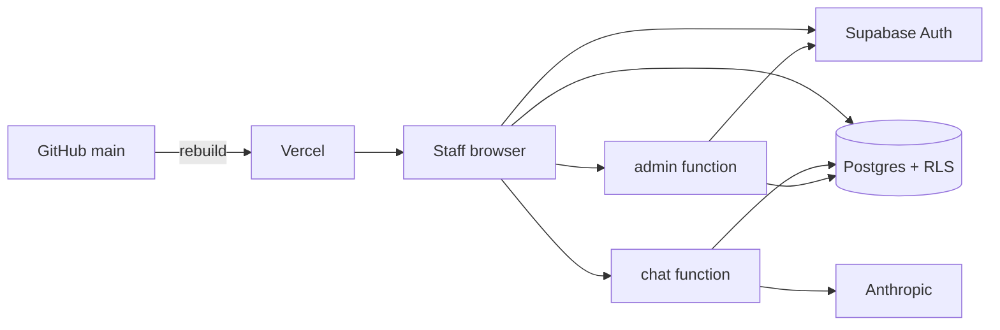
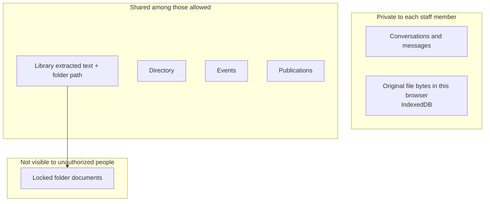
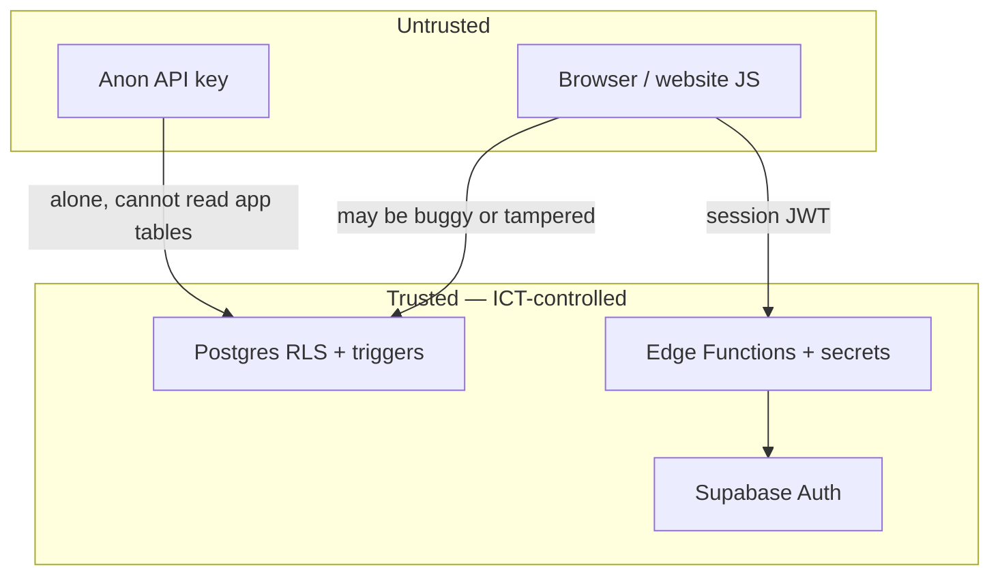

# Architecture

How UNU Nexus is put together: what talks to what, where data lives, and what happens when someone asks a question.

If you only want the picture, the [README diagram](../README.md#how-the-pieces-connect) is enough. This page is the same story with the names of the moving parts.

---

## In plain terms

Staff use a website. That website is a static app (HTML/JavaScript) hosted on **Vercel**, rebuilt whenever **GitHub** `main` changes.

Sign-in and almost all data live on **Supabase**:

- **Auth** — magic-link email, session tokens.
- **Postgres** — tables with **Row Level Security** (rules the database enforces even if the website is buggy or a stranger calls the API).
- **Edge Functions** — small server programmes (`chat`, `admin`) that hold secrets and extra checks the browser must not be trusted with.

The language model is **Anthropic Claude Haiku**. Only `chat` is allowed to call it. The key is a Supabase **secret**, not a Vercel `VITE_` variable.

---

## The four runtime pieces

### 1. The website (`src/`)

| Fact | Detail |
|---|---|
| Stack | React 18, TypeScript, Vite, Tailwind, React Router |
| Routes | `/` chat, `/library`, `/directory`, `/events`, `/publications`, `/admin`, `/login` |
| Auth wrapper | Everything except `/login` requires a session (`ProtectedRoute`) |
| Public config | `VITE_SUPABASE_URL`, `VITE_SUPABASE_ANON_KEY` — baked in at build time. These are *public* by design. They are not the service role key and not the Anthropic key. |
| Local-only | `VITE_ANTHROPIC_API_KEY` and `VITE_DEV_BYPASS_AUTH` work only with `npm run dev`. `vite.config.ts` **throws** if either is set during a production build. |

The browser talks to Supabase in two ways:

- **PostgREST** (the auto API over tables) for rows the user is allowed to touch — conversations, library documents they may see, directory, events, publications, their own profile fields that are not frozen.
- **Edge Functions** via `src/lib/edgeFn.ts`: `Authorization: Bearer <user access token>` plus `apikey: <anon key>`. The function **rejects** a request whose Bearer token *is* the anon key.

Markdown in answers only allows `http(s):` links, in-app paths starting with `/` (not `//`), and citation hashes `#nexus-cite-…` (`src/lib/safeUrl.ts`).

### 2. Postgres (`supabase/*.sql`)

Applied in order:

1. `schema.sql` — tables; RLS enabled with **no policies** (fail closed).
2. `permissions.sql` — `is_admin`, `library_role`, `banned_emails`, folder locks/viewers; bootstrap admin email.
3. `security.sql` — helpers, triggers, scoped policies, grants. **This is the lock-down.**

| Table | What it holds | Who can use it (authenticated, active `@unu.edu`) |
|---|---|---|
| `profiles` | Email, display name, admin flag, library role, disabled | Select: self or admin. Insert/update: self, but **privilege columns are frozen** by trigger. |
| `conversations` / `messages` | Chat threads | Owner only (`user_id` = current profile). |
| `library_documents` | Filename, path, extracted text, size | Select/write per `can_read_library_path` / `can_edit_library`. |
| `directory_contacts` | Directory | All active staff (shared register). |
| `events` / `publications` | Registers | All active staff. |
| `banned_emails` | Ban list | Select: admins. Writes: **not** granted to the browser. |
| `library_folder_locks` / `_viewers` | Folder ACL | Select: locks for active users; viewers for admin or “my own row”. Writes: **not** granted to the browser. |
| `app_settings` | e.g. bootstrap admin emails | No client grants. Service role / SQL editor. |
| `chat_rate_buckets` | Chat rate limit | No client grants. Chat function (service role) only. |

`anon` (not signed in) has **no** table privileges on application data.

### 3. Edge Functions (`supabase/functions/`)

Shared code:

- `_shared/auth.ts` — require a real JWT, not the anon key; `@unu.edu`; not banned; not disabled. `requireAdmin` also checks bootstrap list or `profiles.is_admin`.
- `_shared/cors.ts` — localhost plus `ALLOWED_ORIGINS` (comma-separated, **no trailing slash**, no `*`).
- `_shared/path.ts` — reject `.` / `..` / NUL in folder paths.

**`chat`**

- Model forced: `claude-haiku-4-5`
- `max_tokens` capped at 4096
- System prompt clipped to 400,000 characters
- Last 40 messages, 20,000 characters each
- Tools allowed: `answer`, `source_quotes` only
- Rate limit: 40 requests / 10 minutes / user (`chat_rate_buckets`)

**`admin`**

Actions: `set_admin`, `set_library_role`, `ban_email`, `unban_email`, `disable_profile`, `set_folder_viewers`, `delete_user`. Bootstrap admin cannot be demoted, banned, disabled, or deleted via this function.

**`before-user-created`** (optional Auth hook)

Rejects non-`@unu.edu` at the Auth HTTP hook. SQL trigger on `auth.users` already does this. Hook is defense in depth, not required for domain lock.

### 4. Anthropic

Called only from `chat`. Local `npm run dev` may call Anthropic **from the browser** if `VITE_ANTHROPIC_API_KEY` is set — that path is compile-blocked for production.

---

## Data: what is shared vs private

| Kind | Stored where | Shared? |
|---|---|---|
| Chat | `conversations`, `messages` | No — owner only |
| Library text + path | `library_documents` | Yes, after RLS (role + folder ACL) |
| Original PDF/Word/Excel bytes | Browser **IndexedDB** | No — local preview for that device |
| Directory / events / publications | Postgres tables | Yes, all active staff |
| Privileges, bans, folder ACL writes | Postgres; mutations via `admin` function | Admins |

On load, the app hydrates the library from Postgres, then **drops** any local copies the user must not see (`pruneLibraryByAccess`). The database already omitted locked rows they cannot read; this is a second pass for leftovers on the device.

---

## How a question is answered (technical)

Code: `src/lib/retrieve.ts` → `src/lib/nexus.ts` → `chat` function.

1. **Catalog** — every library file the user is allowed to see: id, path, breadcrumb, size. This is how “where is the file?” works even when the body is not retrieved.
2. **Pinned attachments** — files attached on the composer go in first.
3. **Score** — tokenize the question (stopwords removed). Score filename (heavy), path, breadcrumb, and limited body hits.
4. **Budget** — up to 14 documents, ~28,000 characters each, ~120,000 characters total retrieved text.
5. **System prompt** — retrieved docs + catalog + events register + publications register + (legacy seed document/people blocks if present) + instructions: ground claims, cite, `noAnswer` if thin.
6. **Tool** — model must call `answer` once (structured fields: markdown, sources, follow-ups, flags).
7. **Filter** — source ids that are not known documents/events/publications/uploads are dropped so the UI never shows a phantom citation.
8. **Quotes on demand** — citation click calls `source_quotes` with the claim text, not the whole answer.

The chat function does **not** re-run retrieval. It trusts the packet the signed-in client sent **up to its caps**, after it has verified the person. Combined with RLS, a user cannot include library text they were never allowed to download.

---

## Uploads and path safety

`src/lib/uploads.ts` (browser) and triggers in `security.sql` (database):

| Check | Rule |
|---|---|
| Extension / MIME | PDF, `.docx`, `.xlsx`, CSV, `.txt`/Markdown |
| Legacy Excel | `.xls` refused |
| Magic bytes | PDF must start `%PDF`; Office Open XML must start `PK`; text/CSV must not look like PDF/ZIP |
| Size | 40 MB (browser and database) |
| Extracted text | Truncated at 1,500,000 characters (browser and database) |
| Path | Canonicalized; `.` / `..` / NUL rejected; database raises on invalid path |

Excel is read with **ExcelJS**, not a legacy spreadsheet stack.

PDF text uses `pdfjs-dist` in a worker. Image-only scans yield little or no text and are rejected as “no extractable text.”

---

## Optional connectors

| Connector | When it exists | Notes |
|---|---|---|
| **SharePoint / Microsoft Graph** | `VITE_AZURE_CLIENT_ID` (and optional tenant) | Read-only scopes. Tokens in `sessionStorage`. Files labelled **Confidential** are not imported. Needs UN Azure AD review before production. |
| **Local library folder** | `npm run dev` only | Vite middleware reads a desktop folder. Not in production. |
| **Local JSON for events/publications/directory** | `npm run dev` only | `data/local/*.json` — gitignored. Production uses Postgres. |

---

## Trust boundaries (what we assume)

- We **do not** assume the React app is honest about `isAdmin`.
- We **do** assume Supabase Auth signatures, service role kept off the client, and `ALLOWED_ORIGINS` listing only real site origins.
- We **do not** assume uploads are benign beyond type/size/path checks.

---

## Related

- [Security](security.md) — policies, threats, residual risk  
- [Deploy](deploy.md) — how these pieces are provisioned  
- [Features](features.md) — user-visible behaviour that this architecture enables  
